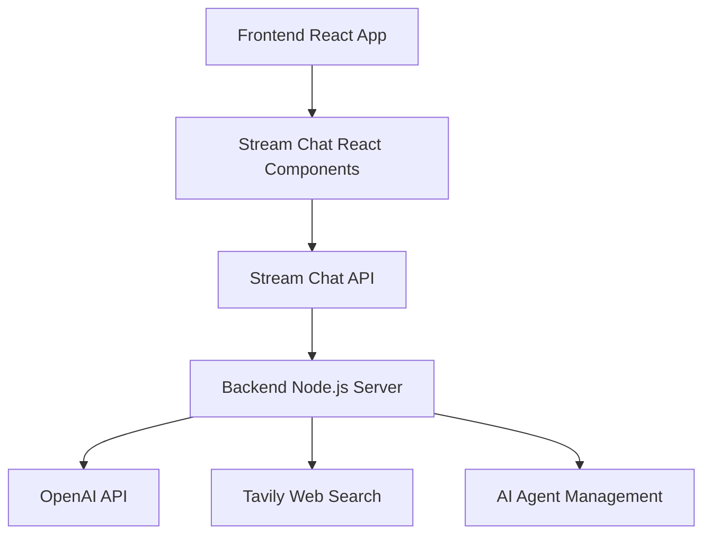

https://github.com/user-attachments/assets/1ea26947-1dca-408d-9741-b24c3429944a


# AI Agent Chat App

This is a modern, full-stack AI-powered chat application featuring:
- Real-time chat (Stream Chat)
- AI writing assistant (OpenAI)
- Live web search (Tavily API)
- Beautiful, responsive UI (React, Tailwind CSS)

The app helps with content creation, research, and collaboration.


## Features

- Real-time chat using [GetStream.io](https://getstream.io)
- AI writing assistant powered by OpenAI GPT-4
- Live web search via Tavily API
- Modern React UI with dark/light theme
- Categorized writing prompts
- Dynamic AI agent management
- Secure JWT authentication
- Mobile-first, responsive design


## Architecture

### Backend (`nodejs-ai-assistant/`)
- Node.js/Express server
- Stream Chat integration
- OpenAI API for AI responses
- Tavily API for web search
- Agent management system

### Frontend (`react-stream-ai-assistant/`)
- React (TypeScript)
- Stream Chat React components
- Tailwind CSS and shadcn/ui
- Vite for development/build


## Prerequisites

- Node.js 20+
- npm or yarn
- GetStream.io account
- OpenAI API account
- Tavily API account


## Setup Instructions

### 1. Clone the Repository

```bash
git clone <your-repository-url>
cd AI-agent-chat-app
```

### 2. Backend Setup

Navigate to the backend directory:

```bash
cd nodejs-ai-assistant
```

Install dependencies:

```bash
npm install
```

Create environment file by copying the example:

```bash
cp .env.example .env
```

Configure your `.env` file with the following keys:

```env
# GetStream credentials - Get these from https://getstream.io/dashboard
STREAM_API_KEY=your_stream_api_key_here
STREAM_API_SECRET=your_stream_api_secret_here

# OpenAI API key - Get from https://platform.openai.com/api-keys
OPENAI_API_KEY=your_openai_api_key_here

# Tavily API key - Get from https://tavily.com
TAVILY_API_KEY=your_tavily_api_key_here
```


### 3. Frontend Setup

Navigate to the frontend directory:

```bash
cd ../react-stream-ai-assistant
```

Install dependencies:

```bash
npm install
```

Create environment file:

```bash
cp .env.example .env
```

Configure your `.env` file:

```env
# Stream Chat Configuration
VITE_STREAM_API_KEY=your_stream_api_key_here

# Backend URL
VITE_BACKEND_URL=http://localhost:3000
```


### 4. Getting API Keys

#### GetStream.io Setup

1. Sign up at [GetStream.io](https://getstream.io/chat/trial/)
2. Create a new Chat application
3. Copy your **API Key** and **API Secret** from the dashboard
4. Use the same **API Key** in both backend and frontend `.env` files

#### OpenAI API Setup

1. Sign up at [OpenAI Platform](https://platform.openai.com/)
2. Navigate to API Keys section
3. Create a new API key
4. Add it to your backend `.env` file

#### Tavily API Setup

1. Sign up at [Tavily](https://tavily.com/)
2. Get your API key from the dashboard
3. Add it to your backend `.env` file


## Running the Application

### Start the Backend Server

```bash
cd nodejs-ai-assistant
npm run dev
```

The backend will run on `http://localhost:3000`


### Start the Frontend Application

```bash
cd react-stream-ai-assistant
npm run dev
```

The frontend will run on `http://localhost:8080`


## How GetStream.io Works

[GetStream.io](https://getstream.io) is a cloud-based API service that provides real-time chat functionality. Here's how it integrates with our app:


### Core Concepts

1. **Stream Chat Client**: Handles all chat operations and real-time updates
2. **Channels**: Individual chat rooms where messages are exchanged
3. **Users**: Authenticated participants in the chat
4. **Messages**: Text, files, reactions, and custom data
5. **Tokens**: JWT-based authentication for secure access


### Integration Flow




### Key Features Used

- **Real-time Messaging**: Instant message delivery and updates
- **User Presence**: Online/offline status indicators
- **Channel Management**: Create, join, and manage chat channels
- **Message Threading**: Support for threaded conversations
- **File Uploads**: Share images and documents
- **Custom Fields**: Extended message and user data
- **Webhooks**: Server-side event handling


## AI Agent System

The application features a flexible AI agent management system:


### Agent Lifecycle

1. **Creation**: AI agents are created per channel when requested
2. **Initialization**: OpenAI assistant setup with web search capabilities
3. **Message Handling**: Processes user messages and generates responses
4. **Web Search**: Automatically searches the web for current information
5. **Cleanup**: Automatic disposal after inactivity


### Agent Capabilities

- **Content Writing**: Various writing tasks from business to creative
- **Web Research**: Live search for current information and facts
- **Context Awareness**: Maintains conversation context
- **Customizable Prompts**: Specialized writing assistance


## UI Components

The frontend uses modern UI components built with:

- **Radix UI**: Accessible component primitives
- **Tailwind CSS**: Utility-first CSS framework
- **shadcn/ui**: Beautiful, customizable components
- **Lucide React**: Modern icon library
- **Dark Mode Support**: System preference detection


## API Endpoints


### Backend Routes

- `GET /` - Health check and server status
- `POST /start-ai-agent` - Initialize AI agent for a channel
- `POST /stop-ai-agent` - Stop and cleanup AI agent
- `GET /agent-status` - Check AI agent status
- `POST /token` - Generate user authentication tokens


## Security Features

- **JWT Authentication**: Secure token-based authentication
- **Environment Variables**: Sensitive data protection
- **CORS Configuration**: Cross-origin request security
- **Token Expiration**: Automatic token refresh system
- **Input Validation**: Server-side validation for all requests


## Deployment


### Backend Deployment

1. Set environment variables on your hosting platform
2. Run `npm run start` for production
3. Ensure PORT is configured (defaults to 3000)


### Frontend Deployment

1. Run `npm run build` to create production build
2. Deploy the `dist` folder to your static hosting service
3. Configure environment variables for production


## Development


### Backend Development

```bash
cd nodejs-ai-assistant
npm run dev  # Starts with nodemon for auto-reload
```


### Frontend Development

```bash
cd react-stream-ai-assistant
npm run dev  # Starts Vite dev server
```


### Building for Production

```bash
# Backend
cd nodejs-ai-assistant
npm run start

# Frontend
cd react-stream-ai-assistant
npm run build
```


## Technologies Used


### Backend

- **Node.js** - Runtime environment
- **Express** - Web framework
- **Stream Chat** - Real-time messaging
- **OpenAI** - AI language model
- **Axios** - HTTP client
- **CORS** - Cross-origin resource sharing
- **TypeScript** - Type safety


### Frontend

- **React** - UI library
- **TypeScript** - Type safety
- **Vite** - Build tool
- **Stream Chat React** - Chat UI components
- **Tailwind CSS** - Styling
- **Radix UI** - Accessible components
- **React Hook Form** - Form handling
- **React Router** - Navigation


## Contributing

1. Fork the repository
2. Create a feature branch
3. Make your changes
4. Test thoroughly
5. Submit a pull request


## License

This project is licensed under the MIT License.


## Support

For support and questions:
- Check the [GetStream.io Documentation](https://getstream.io/chat/docs/)
- Review [OpenAI API Documentation](https://platform.openai.com/docs)
- Create an issue in this repository

---

Built by Rishabh Mishra....
